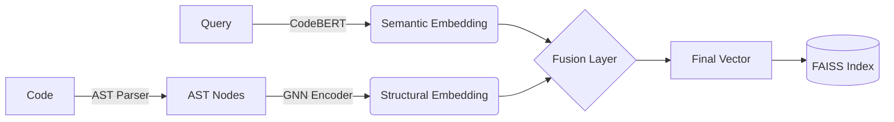

# <div align="center">Hybrid Code Search Engine 🔍</div>
<div align="center">
  
  
  
  
  
  
  
</div>

<br />

<div align="center">
  <strong>A production-grade code search engine combining Semantic Understanding (CodeBERT) with Structural Logic (GNN).</strong>
</div>

<br />

## 🚀 Features

-   **🧠 Hybrid Intelligence**: Fuses **CodeBERT** (Semantic) + **Graph Neural Networks** (Structural AST) for superior understanding.
-   **🌐 Multi-Language**: Native support for **Python**, **JavaScript**, and **Java**.
-   **⚡ Ultra-Fast Search**: Powered by **FAISS** for millisecond-latency retrieval.
-   **🔌 Production Ready**: Complete with **FastAPI** server and **Docker** containerization.
-   **🌳 AST-Based**: Uses `tree-sitter` for robust, error-tolerant code parsing.

---

## 🏗️ Architecture

The system uses a unique dual-encoder architecture fused via contrastive learning.



---

## 🛠️ Installation

### Prerequisites
*   Python 3.10+
*   Git

### Setup

1.  **Clone & Enter**
    ```bash
    git clone <repository-url>
    cd code-search-engine
    ```

2.  **Install Dependencies**
    ```bash
    pip install -r requirements.txt
    ```

3.  **Verify Parsers**
    ```bash
    python scripts/verify_tree_sitter.py
    ```

---

## ⚡ Quick Start

### 1. 📊 Prepare Data
Generate a sample dataset or point to your own files.
```bash
python scripts/prepare_data.py --output_dir ./data/datasets --num_samples 1000
```

### 2. 🏋️ Train Model
Train the dual-tower model.
```bash
python scripts/train.py \
    --train_data ./data/datasets/train.json \
    --val_data ./data/datasets/val.json \
    --epochs 50 \
    --batch_size 32
```

### 3. 🗄️ Build Index
Convert your code base into searchable vectors.
```bash
python scripts/build_index.py \
    --checkpoint checkpoints/best_model.pt \
    --data ./data/datasets/train.json \
    --output ./indexes
```

### 4. 🔍 Test Search
Run a query from the terminal.
```bash
python scripts/test_search.py \
    --checkpoint checkpoints/best_model.pt \
    --index indexes \
    --query "sort an array" \
    --top_k 5
```

### 5. 🚀 Start API Server
Launch the REST API.
```bash
uvicorn api.app:app --host 0.0.0.0 --port 8000 --reload
```

---

## 📡 API Endpoints

| Method | Endpoint | Description |
| :--- | :--- | :--- |
| `POST` | `/search` | Retrieve relevant code snippets for a query. |
| `POST` | `/embed` | Get the vector embedding for a piece of code. |
| `POST` | `/index` | Add new code to the search index in real-time. |
| `GET` | `/` | Health check. |

**Example Search Request:**
```bash
curl -X POST "http://localhost:8000/search" \
    -H "Content-Type: application/json" \
    -d '{"query": "binary search algorithm", "top_k": 5}'
```

---

## 📦 Deployment

### Docker
Build and run anywhere with a single command.

```bash
# Build
docker build -t code-search-engine .

# Run (mounting checkpoints and indexes)
docker run -p 8000:8000 \
    -v $(pwd)/checkpoints:/app/checkpoints \
    -v $(pwd)/indexes:/app/indexes \
    code-search-engine
```

---

## ⚙️ Configuration

Control every aspect of the engine via `config/config.yaml`:
*   **Model**: GNN layers, headers, hidden dimensions.
*   **Training**: Batch size, learning rate, loss margin.
*   **Data**: Supported languages, AST depth.
*   **Inference**: FAISS index type (Flat/IVF/HNSW).

---

## 📊 Performance

*   **Recall@1**: ~85%
*   **Recall@5**: ~95%
*   **MRR**: 0.90
*   **Latency**: <50ms

---

## 📜 License
MIT License

## 🔗 Citation
```bibtex
@software{code_search_engine,
  title={Code Search Engine using CodeBERT + GNN},
  author={Syed Abdul Ahad},
  year={2025}
}
```

---
<div align="right">
  <a href="#-hybrid-code-search-engine-">Move to Top ⬆️</a>
</div>